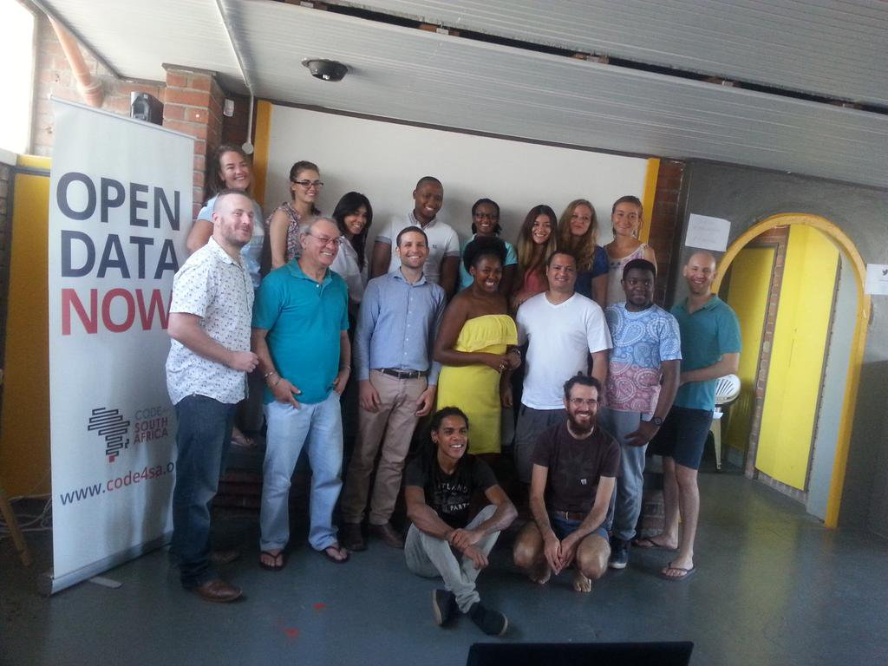

Launched in February this year, the Academy is Africa’s first bricks-and-mortar data journalism training centre for working journalists.

When the current cohort ends at the end of August, 10 working journalists will have been through the programme. [See some of their work here](http://academy.code4sa.org/).

The three month programme consists of a combination of theoretical and hands-on practical work. Participants spend much of their time each day working in our onsite data newsroom alongside experienced data journalists, developers, analysts and data wranglers.

In addition to data and social media journalism training, the Academy also doubles as a  centre for news innovation. Through the newsroom, we regularly experiment with different approaches to delivering content to audiences, with an emphasis on actionable news.

Code for South Africa is actively involved in ongoing projects that promote innovation in the media space through the use of data-driven storytelling and the Academy plays an important role in achieving this.

Each intake consists of up to eight mid-level journalists and the training is aimed at helping them acquire practical data skill-sets that equip them to deliver compelling data-driven multimedia stories.

The newsroom is run by an experienced data news editor, and journalists in the programme work to a diary with short, medium and longer term stories. All the work they produce is owned by their media houses and is fed back to their newsrooms to publish, syndicate or sell.

While they are on the programme, the participants remain productive and producing content for their publications. Their news desks are also able to assign them to do data-driven stories or visualisations.
In order to promote data-driven storytelling in South Africa, the course is heavily subsidised by Code for South Africa donors. The price for the course is R27,000 over the three months. Media houses will be responsible for all costs of their trainees, including accommodation and transport. Financial support may be available based on merit.

For more information about the residency programme, click [here]([http://academy.code4sa.org/residency).

Apply to be part of the next cohort [here](http://academy.code4sa.org/apply).

This is a School of Data initiative kindly sponsored by Omidyar Network, Code for Africa, the International Center for Journalism, and the Indigo Trust.

